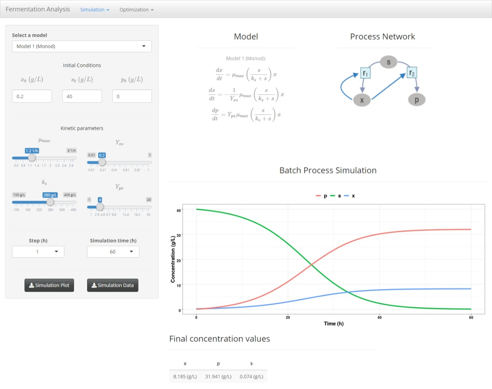
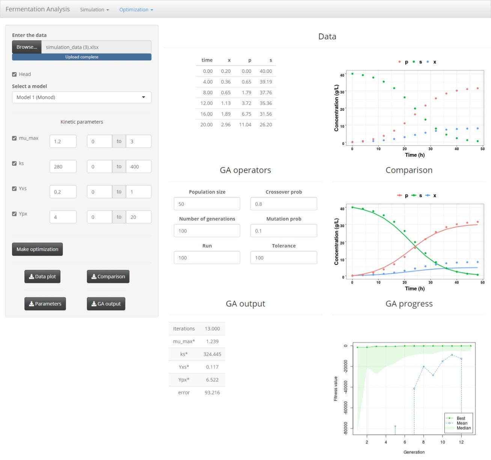

# GAFerm
This GitHub page contains the code used to developed the GAFerm app. A Shiny web application that can be used for the simulation and optimization of fermentation processes. This app allow you to use six different growth kinetic models to simulate fermentation processes in different operation conditions. Also you can use Genetic Algorithms to carry out parametric optimization and to find the optimal inflow rate to a feed batch bioreactor.

### Input variables for **GAFerm**
GAFerm works with standard xlsx-files (.xlsx). The variables used in GAFerm are:

| Variable             	| Description |
|----------------------	|----------------------------------------------------------------------------------	|
| time | time of each sample in the data|
| x | biomass of each sample in the data |
| p | product of each sample in the data |
| s | product of each sample in the data |

Each column must be named with the respective name of the variable that it contains.

## User interface  

### Simulation section
The simulation section allows you to use seven different models and modify their kinetic and operation parameters. This is a useful tool when you are trying tyo understand the differences among the models and evaluate the effect of each parameter in the model.

### Optimization section 
In the optimization secction it's possible to enter you data, select a model and both the parameters and their search ranges. Genetic Algorithms are used to carry out the optimization, so you select the value of the following genetic algorithm parameters: population size, number of generations, crossover probability and mutation probability. 

